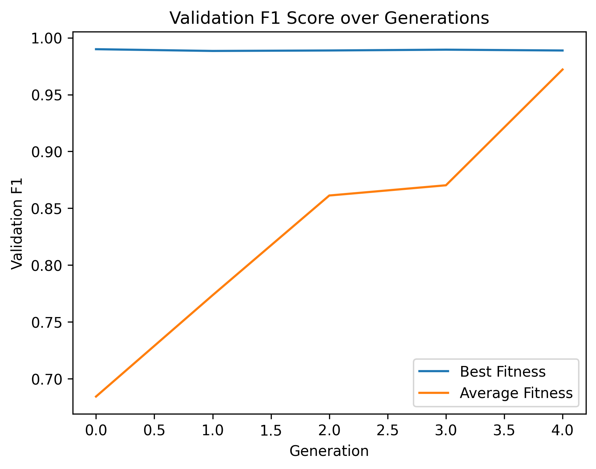
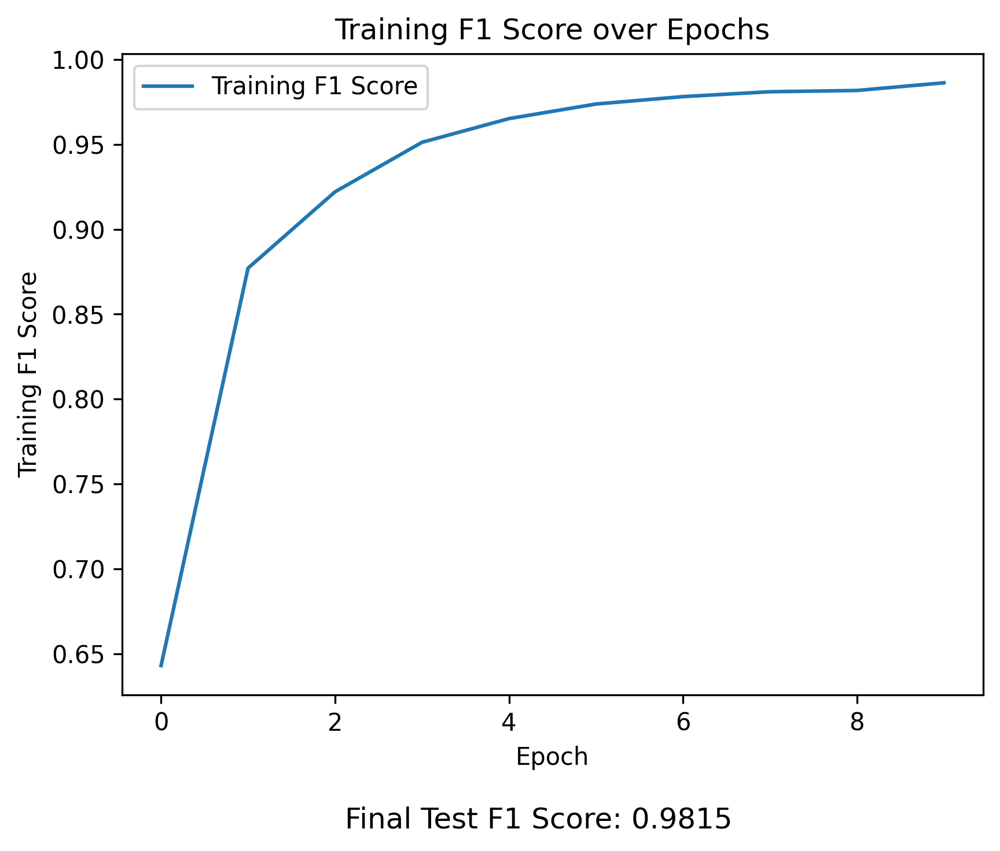

# AutoML README
**Project**: Genetic Algorithm<br>
 **Class**: Northwestern IEMS 469 / MLDS 490 Fall 2025<br>
 **Contributers**: Raymond Gu<br>

## Introduction
In this project, I implemented the Genetic Algorithm to fine tune hyperparameters for image classification on a filtered subset of the Federated EMNIST dataset. I used the Genetic Algorithm to fine tune mini-batch size and activation function in order to maximize validation F1 score. The options for activation function are {ReLU, Tanh, and Sigmoid} and the mini-batch size is in the rage of [16, 1024].<br>

## How To Set Up Project
The `Environment` folder contains the `requirements.txt` and `environment.yml` files. These files contain the libraries and dependencies for the environment I used to run this project. To get these files, I ran the following code:

```
pip freeze > requirements.txt
conda env export > environment.yml
```

Because the original dataset files were too large, they are in a ZIP file. To run this project, unzip the file such that `train_data.npy` and `test_data.npy` are both in the folder `Original Dataset`.

## Processing & Formatting Data
The Federated EMNIST dataset consists of handwritten digits and letters from 100 users. There are 62 classes (10 digits, 26 lowercase, 26 uppercase) and each image is 28 by 28 pixels. For this project, we are only interested in the samples of digits only (10 classes). There are 2 functions used to filter and format the data:

* `Filter_Data`: This function filters the training and test data to include on images of digits (labels 0-9). It saves training images + labels to `train_X.npy` and `train_Y.npy` (where X is images and Y is labels), and test images + labels to `test_X.npy` and `test_Y.npy` in the `Filtered Data` folder.
* `Format_Data`: This function preprocesses images (normalizing pixel values, reshaping, etc.) and splits training data into training and validation sets (80/20 split).

## Model Architecture & Training
For this project, I decided to use a CNN. The architecture for the CNN classifier is shown below:

* **Convolutional Layers**: First, there are 2 convolutional layers (each followed by a pooling layer) used to build a latent representation.

  * **Resolution**: The resolution changes from 28x28 → 14x14 → 7x7.
  * **Channels**: The channels increase from 1 → 32 → 64.
  * **Activation Function**: The activation is configurable (ReLU, Tanh, or Sigmoid) and applied after each convoluational layer.

* **Fully Connected Layers**: After the convolutional layers, there are 2 fully connected layers.
  * **Nodes**: The number of nodes go from 3136 (64x7x7) → 128 → 10 (logits for each class).
  * **Activation Function**: The activation is configurable (ReLU, Tanh, or Sigmoid) and applied after layer 1.
  * **Dropout**: After the first fully connect layer, 25% of nodes are dropped to make the network more robust.

The model is trained by using stochastic gradient descent (SGD) with Nesterov momentum to help improve convergence stability. For the evaluation metric, I used maco-averaged F1 score.

## Genetic Algorithm
I implemented the Genetic Algorithm using the roulette rule, one-point crossover, and age based selection. Each individual in the population represents a candidate with a specific set of parameters for batch size and activation function. Here are some notes about my implementation of the Genetic Algorithm:

* **Fitness Metric**: Validation macro F1 score was used for each individual's fitness in the population.
* **Roulette Rule + Age Based Selection**: When selecting parents for the next generation, I used the roulette rule where individuals with higher adjusted fitness (validation macro F1 score penalized by age) are more likely to be chosen as parents.
* **One-Point Crossover**: Pairs of parents produce children through one-point crossover, which swaps batch size and activation function across the crossover point. After crossover, each child is mutated with a fixed probability by randomly changing either hyperparameter.
* **Generation Formation**: To form the next generation, the algorithm keeps the top half of the parent population and fills the remaining slots with children. This ensures both retention of strong performers and injection of new diversity.

### | Genetic Algorithm Results
To run the Genetic Algorithm, you can use the `run_genetic_algorithm` function. This function will produce a graph that shows the average and highest fitness score of the population every generation and save it to the `Graphs` folder as `genetic_algorithm_history.png`. This graph is shown below:



### | Testing Best Hyperparameters
After running the Genetic Algorithm to find the best values for batch size and activation function, you can train a model with those hyperparameters by using the `use_best_parameters` function. This function will produce a graph that shows the training macro F1 score every epoch and displays the test macro F1 score at the end of training. This graph will be saved to the `Graphs` folder as `genetic_algorithm_best_parameters.png` as is shown below:

